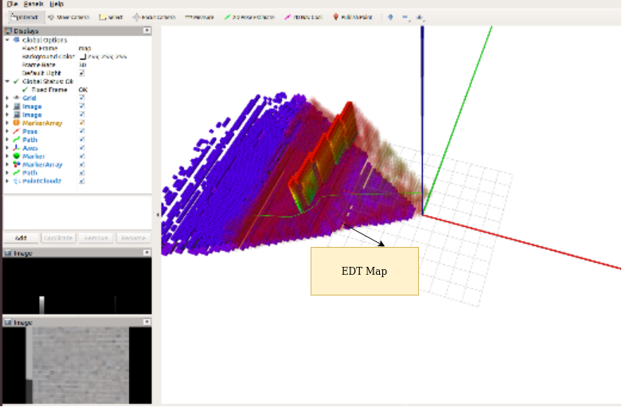

# FastPlannerOctomap

## Obstacle avoidance for drones using FastPlanner (https://github.com/HKUST-Aerial-Robotics/Fast-Planner), PX4 and Octomap.

## Modules

*********

### Mapping
* Mapping has been done using Octomap  
* Fixed size euclidean distance map is computed using EDT3D Library (https://github.com/OctoMap/octomap/tree/devel/dynamicEDT3D) for collision check.
* Fixed Size EDT map gets updated around the drone after it travels a threshold distance from the previous location at which map was updated (here threshold is 1 metres).
* Point cloud from the RGBD sensor (RealSense D415 and D455 were tested) is downsampled using pcl_ros
* Zero mean Gaussian noise is added on the point cloud using pcl library

* *Installing mapping dependencies*

      sudo apt-get install ros-$DISTRO-octomap-*  
      sudo apt-get install ros-$DISTRO-pcl-ros

      git clone https://github.com/OctoMap/octomap 
             (Octomap source code is needed to generate EDT map (DynamicEDT3D class))

      cd octomap

      mkdir build

      cd build

      cmake .. && make

      sudo make install

#

### Planning
* Path planning is done using Fast-Planner (https://github.com/HKUST-Aerial-Robotics/Fast-Planner) developed by HKUST Aerial Robotics Group
* Changes have been made in the source code in order to use it with Octomap.
* Goal location is currently given in cartesian coordinates (using RViZ 2D Nav Goal and height of the goal is taken from the user)

#

### Control
* PX4-Autopilot firmware has been used to control the drone (https://github.com/PX4/PX4-Autopilot).
* Trajectory generated by the planner is traversed using offboard position control.
* Position messages (with and without yaw) is published on the topic /mavros/setpoint_local/position.
* Mavros has been used to pass the waypoints to the Pixhawk flight controller.

* Installing PX4-Autopilot
   
       Refer to https://github.com/PX4/PX4-Autopilot for setting up PX4 for simulation

* Installing Mavros
    
      sudo apt-get install ros-$DISTRO-mavros ros-$DISTRO-mavros-extras

      wget https://raw.githubusercontent.com/mavlink/mavros/master/mavros/scripts/install_geographiclib_datasets.sh

      sudo bash ./install_geographiclib_datasets.sh   

#

### Localization
* GPS is used for localizing the drone 
* Poses given by the EKF in PX4 is used (/mavros/local_position/pose)

 | 

***

## Install and Run (Tested in ros melodic)
* Building package
    
      sudo apt-get install libeigen3-dev

      mkdir catkin_ws
      cd catkin_ws
      mkdir src   
      cd src
      git clone https://github.com/deepak-1530/FastPlannerOctomap
      cd ..
      catkin_make

### Running the Planner
* Simulation

        Terminal-1 : cd PX4-Autopilot && sudo no_sim=1 make px4_sitl_gazebo

        Terminal-2 : cd PX4-Autpilot && source Tools/setup_gazebo.bash $(pwd) $(pwd)/build/px4_sitl_default && roslaunch gazebo_ros empty_world.launch (set your world file as required). On the gazebo window, select iris_depth_camera from the left panel.

        Terminal-3 : cd catkin_ws && **roslaunch FastPlannerOctomap MappingSim.launch** (give goal location using 2D Nav Goal option)

        Terminal-4 : **rosrun FastPlannerOctomap Planner** (or noYawPlanner if you want to plan the trajectory keeping the heading or yaw of the drone fixed). For the startOver option select either 1 or 0. Refer to the source code (FastPlannerOctomap/src/kinodynamic_astar.cpp and Planner.cpp for details). Also give the height (in metres) of the goal location when prompted.

        Terminal-5 : **rosrun FastPlannerOctomap Controller**

* Running on hardware

        Terminal-1 : Launch the depth camera (I used realsense_ros package and rs_camera.launch file)

        Terminal-2 : roslaunch mavros px4.launch 

        Terminal-3 : roslaunch FastPlannerOctomap MappingDrone.launch

                     Running the planner and controller remain the same as in simulation.

                     Remote Desktop is used to run rviz and give the goal location.
